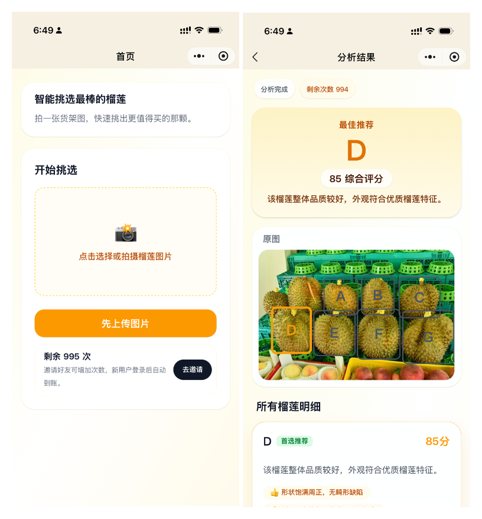

# 榴莲识别小程序

一个面向微信小程序的榴莲分析项目。用户上传榴莲图片后，系统会先做目标检测与稳定编号，再结合多模态模型输出每个榴莲的评分、风险提示和推荐结果。


## 项目截图




## 项目能力

当前主流程如下：

1. 用户在小程序上传榴莲图片
2. Python CV 服务使用 YOLO 检测图片中的榴莲
3. 检测服务对榴莲进行稳定排序并分配 `A/B/C...` 编号
4. NestJS 后端组织整图、裁剪图和检测结果
5. 多模态模型对每个榴莲打分并生成说明
6. 小程序展示综合评分、推荐榴莲和分析理由

## 项目结构

```text
durian-helper-mini-program/
├── Readme.md                  # 项目总览
├── docker-compose.yml         # Postgres / Redis / CV / Backend 联调编排
├── client/                    # Taro + React 微信小程序
├── server/                    # NestJS API 服务
├── cv-service/                # FastAPI + YOLO 视觉检测服务
└── image.png                  # 小程序截图
```

各目录职责：

- `client`
  Taro 4 + React 18 小程序前端，当前包含首页和结果页两个核心页面。
- `server`
  NestJS 主后端，负责登录鉴权、图片上传、分析任务编排、结果聚合、用户额度等逻辑。
- `cv-service`
  Python CV 微服务，负责榴莲检测、稳定编号、整图标注和 crop 图生成。

## 技术栈

- 小程序端：Taro 4、React 18、TypeScript、Zustand、Tailwind 相关工具链
- 主后端：NestJS 11、TypeScript、Drizzle ORM、PostgreSQL、Redis
- CV 服务：FastAPI、YOLO
- AI 能力：通过后端统一调用多模态模型完成榴莲评分

## 核心接口链路

根链路大致如下：

1. 小程序调用后端登录接口 `POST /api/v1/auth/login`
2. 小程序上传图片到 `POST /api/v1/durians/analyze`
3. 后端保存原图到 `server/uploads/`
4. 后端调用 `cv-service` 的 `/detect-and-annotate`
5. 后端将标注图、crop 图和编号交给 AI 模型评分
6. 小程序轮询：
   - `GET /api/v1/durians/tasks/:taskId`
   - `GET /api/v1/durians/tasks/:taskId/result`

健康检查接口：

- 后端：`GET /api/v1/health`
- CV 服务：`GET /health`

## 本地开发环境

建议版本：

- Node.js 20+
- npm 10+
- Python 3.12
- Docker / Docker Compose

首次准备：

```bash
cp .env.example .env
```

需要重点填写的环境变量：

- `POSTGRES_PASSWORD`
- `JWT_SECRET`
- `WECHAT_APP_ID`
- `WECHAT_APP_SECRET`
- `ARK_API_KEY`（如果要启用真实 AI 评分）

说明：

- 未配置 `ARK_API_KEY` 时，后端会回退到启发式评分逻辑，适合本地联调。
- `.env.example` 中默认本地 `cv-service` 地址为 `http://127.0.0.1:8010`。

## 快速启动

### 方式一：使用 Docker 启动服务端依赖

适合快速联调后端和 CV 服务：

```bash
docker compose up --build
```

默认端口：

- 后端：`http://127.0.0.1:5000`
- CV 服务：容器内 `8010`
- PostgreSQL：`5436`
- Redis：容器内 `6379`

说明：

- `docker-compose.yml` 会启动 `postgres`、`redis`、`cv-service`、`backend`
- 后端对外暴露端口由 `BACKEND_PORT` 控制，默认 `5000`
- 上传文件会挂载到 `server/uploads/`

### 方式二：分模块本地启动

#### 1. 启动 CV 服务

```bash
cd cv-service
python3 -m venv .venv
source .venv/bin/activate
python -m pip install --upgrade pip
pip install -r requirements.txt
uvicorn app.main:app --reload --port 8010
```

启动后可访问：

- `http://127.0.0.1:8010/health`
- `http://127.0.0.1:8010/docs`

#### 2. 启动主后端

```bash
cd server
npm install
npm run dev
```

默认开发地址：

- `http://127.0.0.1:3000/api/v1/health`

如果要使用数据库能力，还需要确保 Postgres 和 Redis 已就绪。仓库提供的 `docker-compose.yml` 可以单独拿来启动这两个依赖。

#### 3. 启动小程序端

```bash
cd client
npm install
npm run dev:weapp
```

然后用微信开发者工具打开 `client/dist` 目录进行预览。

补充说明：

- 小程序工程配置位于 `client/project.config.json`
- 当前页面入口：
  - `pages/index/index`
  - `pages/result/index`

## 常用命令

### client

```bash
cd client
npm run dev:weapp
npm run build:weapp
npm run test:unit
```

### server

```bash
cd server
npm run dev
npm run build
npm run test
npm run db:generate
npm run db:migrate
```

### cv-service

```bash
cd cv-service
./.venv/bin/pytest tests -q
```


