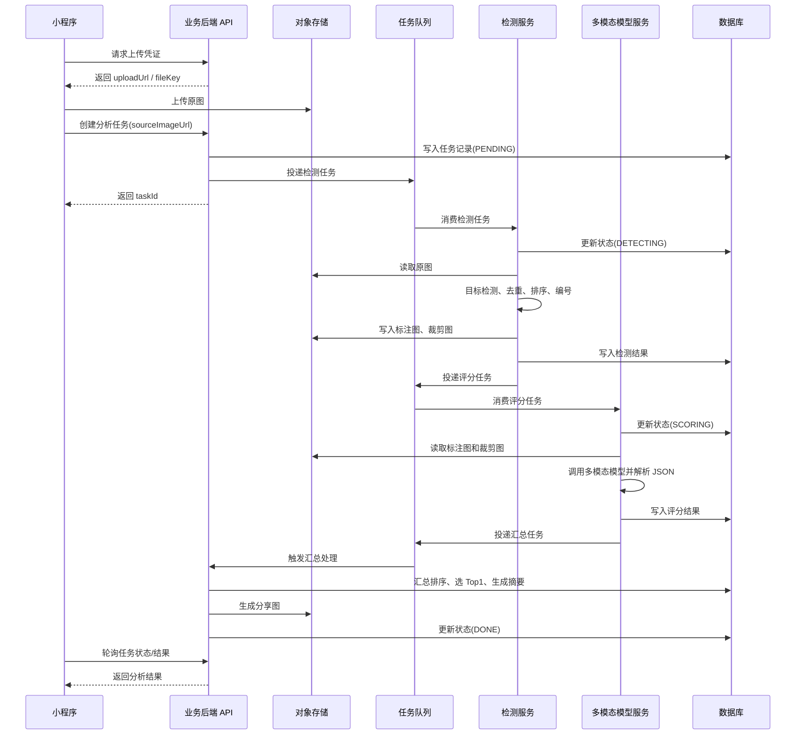
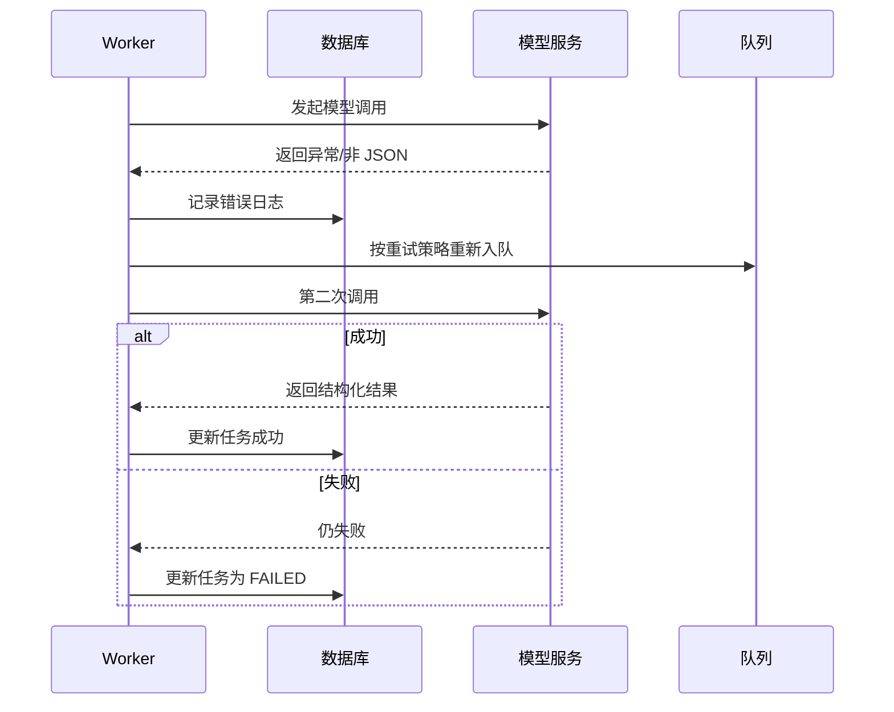
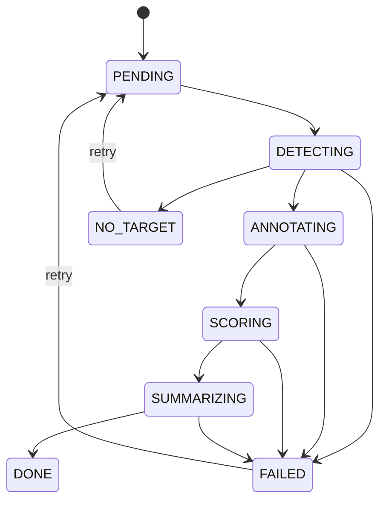

**《AI 挑选榴莲小程序》后端技术方案书**

**1. 文档信息**
- 项目名称：AI 挑选榴莲小程序
- 文档范围：后端架构、接口设计、数据库表结构、任务时序、实施计划
- 目标读者：后端研发、算法研发、测试、产品、项目负责人
- 文档目标：指导后端 MVP 到上线版本的设计与实施

**2. 项目背景**
用户上传一张榴莲陈列图，系统自动识别图片中的多个榴莲，对每个榴莲进行编号，并结合多模态大语言模型输出评分、解释和推荐结果，最终返回可展示、可分享的分析报告。

本项目只讨论后端实现，不涉及小程序前端页面设计。

---

**3. 建设目标**

**3.1 业务目标**
- 支持用户上传榴莲图片并发起分析
- 自动识别图片中的多个榴莲并稳定编号
- 对每个榴莲输出结构化评分与推荐理由
- 给出最佳推荐榴莲及排序结果
- 支持生成分析结果分享图

**3.2 技术目标**
- 保证分析链路稳定、可追踪、可重试
- 支持模型能力迭代，不影响业务接口
- 控制多模态模型调用成本
- 具备基础监控、日志、审计与版本管理能力

**3.3 非目标**
- 不承诺通过图片精确判断真实口感、出肉率或内部熟度
- 不在一期内支持视频流分析
- 不在一期内实现线下硬件采集或敲击声学分析

---

**4. 业务流程概述**
系统核心流程如下：

1. 用户上传图片
2. 后端创建分析任务
3. 检测服务识别榴莲目标并输出边界框
4. 后端按照稳定规则对目标进行排序编号
5. 生成带编号标注图与每个榴莲裁剪图
6. 调用多模态模型对每个编号榴莲进行评分与解释
7. 对模型结果做结构化校验与后处理
8. 生成推荐结果、结果详情、分享图
9. 前端查询任务状态并展示结果

---

**5. 总体架构设计**

**5.1 架构原则**
- 检测与评分解耦：目标检测由视觉模型负责，推荐解释由多模态模型负责
- 异步优先：分析流程拆分为异步任务，避免接口长时间阻塞
- 结果可追溯：保留模型版本、提示词版本、原始响应与评分结果
- 易扩展：允许后续替换检测模型或多模态模型
- 可维护：接口、任务状态、表结构与日志都保持清晰边界

**5.2 逻辑架构**
- API 层：接收上传、创建任务、查询状态、查询结果、重试任务
- 任务编排层：控制检测、标注、评分、汇总、分享图生成
- 视觉识别层：榴莲检测、边界框清洗、稳定排序、裁剪
- AI 分析层：多模态评分、结构化输出校验、推荐排序
- 存储层：数据库、对象存储、缓存、队列
- 运维支撑层：日志、监控、告警、成本统计

**5.3 推荐技术选型**
- 业务后端：`NestJS`
- 检测服务：`Python + FastAPI`
- 检测模型：`YOLOv8/YOLO11` 或同类目标检测模型
- 队列：`BullMQ + Redis`
- 数据库：`PostgreSQL`
- 对象存储：`COS/OSS/S3`
- 图片处理：`Sharp`
- 分享图生成：`node-canvas` 或服务端 HTML 转图
- 部署方式：`Docker`

---

**6. 核心模块设计**

**6.1 图片接入模块**
职责：
- 接收前端图片上传或图片 URL
- 做格式、大小、安全校验
- 存储原图并生成统一访问地址
- 创建分析任务记录

校验规则建议：
- 支持格式：`jpg/jpeg/png/webp`
- 文件大小限制：建议不超过 `10MB`
- 图片最小分辨率：建议不低于 `720px` 宽
- 图片内容安全：必要时增加违规图像审查

**6.2 榴莲检测与编号模块**
职责：
- 调用检测模型识别所有榴莲
- 过滤低置信度框
- 去除重叠或重复框
- 按固定规则排序并映射编号
- 输出边界框、编号、标注图、裁剪图

编号规则建议：
- 先基于目标中心点 `y` 坐标进行分层
- 同层内按 `x` 坐标升序编号
- 层间按 `y` 坐标升序编号

说明：
该规则的目的是保证同一张图多次分析时编号尽量稳定，避免 A/B/C 顺序漂移。

**6.3 AI 评分模块**
职责：
- 构造模型输入
- 发送整图和局部图给多模态模型
- 要求输出严格 JSON
- 解析与校验模型输出
- 生成每个榴莲的评分和解释

建议输入：
- 1 张带编号整图
- N 张单个榴莲裁剪图
- 结构化评分提示词
- 统一评分规则和输出格式说明

建议评分维度：
- 外观成熟度：25 分
- 果形饱满度：20 分
- 果刺形态特征：20 分
- 新鲜度与损伤风险：20 分
- 综合购买建议：15 分

总分：100 分

**6.4 结果汇总模块**
职责：
- 校验所有编号是否有评分结果
- 处理异常值、空值与非法 JSON
- 计算推荐顺序
- 生成总结文案
- 生成分享图或分享卡片信息

推荐输出：
- 最佳推荐：Top1
- 推荐排序：TopN
- 每个榴莲的评分和理由
- 风险提示
- 适合分享的结果摘要

**6.5 任务调度模块**
职责：
- 创建异步任务
- 拆分检测任务、评分任务、汇总任务
- 记录状态迁移
- 处理失败重试
- 避免同任务重复消费

---

**7. 关键技术设计**

**7.1 为什么采用“检测模型 + 多模态模型”的两段式方案**
原因如下：
- 检测任务属于空间定位问题，检测模型更稳定
- 多模态模型更适合做解释与综合判断
- 两段式便于独立优化检测精度与评分规则
- 避免直接让大模型负责检测导致编号漂移、漏检和成本过高

**7.2 结构化输出约束**
必须要求多模态模型返回固定 JSON，否则后端难以稳定消费。

示例返回：
```json
{
  "items": [
    {
      "label": "G",
      "score": 88,
      "summary": "成熟度较好，果形饱满，优先推荐",
      "reasons": [
        "颜色黄绿适中",
        "果形圆润",
        "果刺偏钝且间距适中"
      ],
      "risks": [
        "未见明显裂口",
        "建议尽快食用"
      ],
      "buy_priority": 1
    }
  ]
}
```

**7.3 后处理策略**
- 分数范围校验：`0-100`
- 编号去重校验：每个 `label` 只能出现一次
- 缺失项补偿：若部分榴莲未返回，标记为失败并进入重试或降级
- 排序规则：先按 `buy_priority`，再按 `score`，最后按 `label`

**7.4 异常处理策略**
- 检测失败：任务直接置为 `FAILED`
- 检测为空：任务置为 `NO_TARGET`
- 大模型非 JSON：自动重试 1 次
- 大模型部分缺失：可选重试或标记局部失败
- 分享图生成失败：不影响主结果，可降级返回纯文本结果

---

**8. 性能、稳定性与运维要求**

**8.1 性能目标**
- 单张图片任务创建接口：`< 500ms`
- 检测阶段：`1-3s`
- 评分阶段：`3-10s`，视模型与目标数量而定
- 整体任务完成：目标 `5-15s`

**8.2 稳定性目标**
- 任务成功率：`>= 95%`
- 关键任务支持自动重试
- 失败任务支持人工重放
- 所有状态迁移都有日志记录

**8.3 成本控制**
- 上传后先压缩图片
- 只把整图和必要裁剪图送入模型
- 对重复请求做缓存
- 保留模型 token、耗时与调用次数统计

**8.4 监控项**
- API 成功率与耗时
- 队列积压量
- 检测成功率
- 模型调用成功率
- 单任务平均成本
- 按模型版本的误差或投诉率

---

**9. 安全与合规**
- 上传图片进行文件类型校验与防恶意文件处理
- 存储访问采用签名 URL 或私有桶策略
- 用户维度的数据隔离
- 日志中避免长期保存敏感用户标识
- 模型原始输入输出建议设置保留周期

---

**10. 实施阶段规划**

**阶段一：MVP**
目标：跑通全链路
- 图片上传
- 任务创建
- 榴莲检测
- 编号与标注图生成
- 模型评分
- Top1 推荐输出

**阶段二：增强版**
目标：补齐工程能力
- 分享图生成
- 重试机制
- 状态轮询
- 监控告警
- 日志追踪
- 成本统计

**阶段三：上线版**
目标：产品化与可运营
- 历史记录
- 模型与提示词版本管理
- 运营后台查询任务
- 异常分析报表
- 灰度切换模型版本

---

**《接口设计》**

**1. 统一约定**
- 接口前缀：`/api/v1`
- 数据格式：`application/json`
- 文件上传可采用服务端直传或先获取上传凭证
- 所有响应统一包含：
  - `code`
  - `message`
  - `data`
  - `requestId`

**2. 获取上传凭证**
`POST /api/v1/files/upload-policy`

用途：
- 获取对象存储上传凭证，前端直接上传图片

请求示例：
```json
{
  "bizType": "durian-analysis",
  "contentType": "image/jpeg"
}
```

响应示例：
```json
{
  "code": 0,
  "message": "ok",
  "data": {
    "fileKey": "durian/2026/03/11/abc.jpg",
    "uploadUrl": "https://example-upload-url",
    "publicUrl": "https://example-cdn-url"
  },
  "requestId": "req_xxx"
}
```

**3. 创建分析任务**
`POST /api/v1/durian-analysis/tasks`

请求示例：
```json
{
  "sourceImageUrl": "https://cdn.example.com/durian/2026/03/11/abc.jpg"
}
```

响应示例：
```json
{
  "code": 0,
  "message": "ok",
  "data": {
    "taskId": "task_20260311_xxx",
    "status": "PENDING"
  },
  "requestId": "req_xxx"
}
```

**4. 查询任务状态**
`GET /api/v1/durian-analysis/tasks/{taskId}`

响应示例：
```json
{
  "code": 0,
  "message": "ok",
  "data": {
    "taskId": "task_20260311_xxx",
    "status": "SCORING",
    "progress": 70,
    "statusText": "正在进行榴莲评分"
  },
  "requestId": "req_xxx"
}
```

建议状态枚举：
- `PENDING`
- `DETECTING`
- `ANNOTATING`
- `SCORING`
- `SUMMARIZING`
- `DONE`
- `FAILED`
- `NO_TARGET`

**5. 获取任务结果**
`GET /api/v1/durian-analysis/tasks/{taskId}/result`

响应示例：
```json
{
  "code": 0,
  "message": "ok",
  "data": {
    "taskId": "task_20260311_xxx",
    "sourceImageUrl": "https://cdn.example.com/source.jpg",
    "annotatedImageUrl": "https://cdn.example.com/annotated.jpg",
    "shareImageUrl": "https://cdn.example.com/share.jpg",
    "bestPick": {
      "label": "G",
      "score": 88,
      "summary": "成熟度较好，果形饱满，优先推荐"
    },
    "rankedItems": [
      {
        "label": "G",
        "score": 88,
        "buyPriority": 1,
        "summary": "成熟度较好，果形饱满，优先推荐",
        "reasons": ["颜色黄绿适中", "果形圆润", "果刺偏钝"],
        "risks": ["建议尽快食用"]
      },
      {
        "label": "H",
        "score": 86,
        "buyPriority": 2,
        "summary": "成熟度较高，体积饱满",
        "reasons": ["外观偏黄", "体积较大"],
        "risks": ["未见明显裂口"]
      }
    ],
    "summaryText": "本次共识别 9 个榴莲，推荐优先选择 G，其次为 H。"
  },
  "requestId": "req_xxx"
}
```

**6. 重试任务**
`POST /api/v1/durian-analysis/tasks/{taskId}/retry`

用途：
- 对失败任务重新投递
- 可限制只有 `FAILED` 和 `NO_TARGET` 状态可重试

响应示例：
```json
{
  "code": 0,
  "message": "ok",
  "data": {
    "taskId": "task_20260311_xxx",
    "status": "PENDING"
  },
  "requestId": "req_xxx"
}
```

**7. 查询历史任务列表**
`GET /api/v1/durian-analysis/tasks/history?pageNo=1&pageSize=10`

用途：
- 支持用户查看历史分析记录

**8. 获取分享卡信息**
`GET /api/v1/durian-analysis/tasks/{taskId}/share-card`

用途：
- 返回分享图片 URL 或分享文案摘要

---

**《数据库表结构》**

以下为建议表结构，命名采用 PostgreSQL 风格。

**1. 分析任务表 `durian_analysis_task`**
用途：
- 存放任务主记录、状态与核心结果入口

字段建议：

| 字段名 | 类型 | 说明 |
|---|---|---|
| id | varchar(64) PK | 任务 ID |
| user_id | varchar(64) | 用户 ID |
| source_image_url | text | 原图地址 |
| source_image_width | int | 原图宽 |
| source_image_height | int | 原图高 |
| annotated_image_url | text | 标注图地址 |
| share_image_url | text | 分享图地址 |
| status | varchar(32) | 任务状态 |
| progress | int | 进度百分比 |
| detect_model | varchar(64) | 检测模型版本 |
| score_model | varchar(64) | 评分模型版本 |
| prompt_version | varchar(32) | 提示词版本 |
| total_item_count | int | 识别出的榴莲数 |
| best_pick_label | varchar(8) | 推荐编号 |
| best_pick_score | int | 推荐分数 |
| summary_text | text | 结果摘要 |
| error_code | varchar(64) | 失败码 |
| error_message | text | 失败信息 |
| started_at | timestamp | 开始时间 |
| finished_at | timestamp | 结束时间 |
| created_at | timestamp | 创建时间 |
| updated_at | timestamp | 更新时间 |
| deleted_at | timestamp null | 软删除时间 |

索引建议：
- `idx_durian_analysis_task_user_id_created_at`
- `idx_durian_analysis_task_status`
- `idx_durian_analysis_task_created_at`

**2. 分析结果明细表 `durian_analysis_item`**
用途：
- 存储每个榴莲的检测结果、评分结果与排序信息

字段建议：

| 字段名 | 类型 | 说明 |
|---|---|---|
| id | bigserial PK | 主键 |
| task_id | varchar(64) | 任务 ID |
| label | varchar(8) | 编号，如 A/B/C |
| bbox_x | int | 边界框左上角 x |
| bbox_y | int | 边界框左上角 y |
| bbox_w | int | 边界框宽 |
| bbox_h | int | 边界框高 |
| center_x | int | 中心点 x |
| center_y | int | 中心点 y |
| detect_confidence | numeric(5,4) | 检测置信度 |
| crop_image_url | text | 裁剪图地址 |
| score | int | 综合评分 |
| buy_priority | int | 购买优先级，1 为最好 |
| summary | text | 单个榴莲摘要 |
| reasons_json | jsonb | 推荐理由数组 |
| risks_json | jsonb | 风险提示数组 |
| raw_model_item_json | jsonb | 该榴莲原始模型结果 |
| created_at | timestamp | 创建时间 |
| updated_at | timestamp | 更新时间 |

约束建议：
- `unique(task_id, label)`

索引建议：
- `idx_durian_analysis_item_task_id`
- `idx_durian_analysis_item_task_id_buy_priority`

**3. 模型调用日志表 `durian_analysis_model_log`**
用途：
- 记录每次模型调用请求与响应，便于排查和成本统计

字段建议：

| 字段名 | 类型 | 说明 |
|---|---|---|
| id | bigserial PK | 主键 |
| task_id | varchar(64) | 任务 ID |
| phase | varchar(32) | 阶段：detect/score/summary |
| model_name | varchar(64) | 模型名称 |
| model_version | varchar(64) | 模型版本 |
| prompt_version | varchar(32) | 提示词版本 |
| request_payload | jsonb | 请求内容摘要 |
| response_payload | jsonb | 响应内容摘要 |
| prompt_tokens | int | 输入 token |
| completion_tokens | int | 输出 token |
| latency_ms | int | 调用耗时 |
| success | boolean | 是否成功 |
| error_message | text | 错误信息 |
| created_at | timestamp | 创建时间 |

索引建议：
- `idx_durian_analysis_model_log_task_id`
- `idx_durian_analysis_model_log_created_at`

**4. 任务事件表 `durian_analysis_event`**
用途：
- 做状态迁移与审计跟踪

字段建议：

| 字段名 | 类型 | 说明 |
|---|---|---|
| id | bigserial PK | 主键 |
| task_id | varchar(64) | 任务 ID |
| event_type | varchar(64) | 事件类型 |
| event_payload | jsonb | 事件内容 |
| created_at | timestamp | 创建时间 |

可选事件：
- `TASK_CREATED`
- `DETECT_STARTED`
- `DETECT_FINISHED`
- `SCORING_STARTED`
- `SCORING_FINISHED`
- `TASK_DONE`
- `TASK_FAILED`

---

**《任务时序图》**

**1. 主流程时序图**


**2. 失败重试时序图**


**3. 状态流转图**


---

**《任务拆分与队列设计》**

建议最少拆成三个队列消费者：

1. `durian-detect-queue`
职责：
- 下载原图
- 调检测模型
- 输出编号、标注图、裁剪图

2. `durian-score-queue`
职责：
- 构造大模型输入
- 解析结构化评分结果
- 写入 `durian_analysis_item`

3. `durian-summary-queue`
职责：
- 汇总结果
- 生成推荐摘要
- 生成分享图
- 更新任务完成状态

每个队列都建议：
- 配置最大重试次数
- 配置指数退避
- 配置超时时间
- 避免同任务并发执行

---

**《提示词与评分协议建议》**

为了后端稳定消费，建议把评分协议固定成“业务契约”。

**模型系统指令要点：**
- 你只分析后端已经编号的榴莲
- 不允许新增或修改编号
- 只根据可见外观进行判断
- 看不清的情况要保守处理
- 必须按 JSON 输出，不得输出额外说明文字

**单任务评分协议字段：**
- `label`
- `score`
- `summary`
- `reasons`
- `risks`
- `buy_priority`

**意图说明：**
评分协议是后端与模型之间的稳定接口，后续即便替换模型，也尽量不变更该 JSON 结构，以降低维护成本。

---


